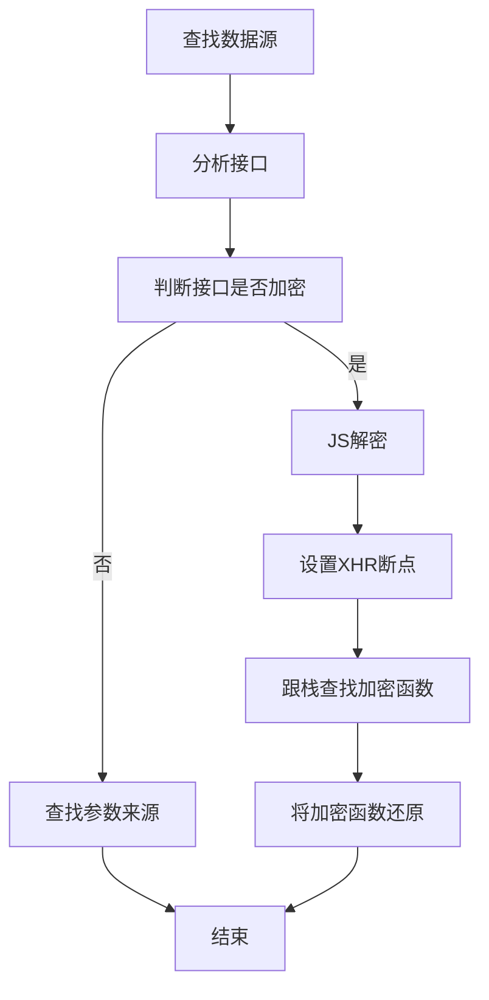

## 概要
#### ECDAS说明

ECDSA（‌[椭圆曲线数字签名算法](https://www.baidu.com/s?wd=椭圆曲线数字签名算法&usm=4&ie=utf-8&rsv_pq=822968be00f739b4&oq=ecdsa算法&rsv_t=d1abeIqu4%2BEXRn8yW%2FR7b7nTFjwEWaNNO9qQWipLJ3YTITynUEqQtrQIT5A&rsv_dl=re_dqa_generate&sa=re_dqa_generate)）的参数主要包括：

1. ‌**椭圆曲线**‌：通常表示为
   $$
   E: y² = x³ + ax + b (mod p)
   $$
   ，其中p是一个大素数，a、b、x和y均在有限域GF(p)中取值，且要求4a³ + 27b² ≠ 0。曲线的选择决定了算法的安全性，曲线的阶（即曲线上离散点的数量）越大，安全性越高。

2. ‌**基点G**‌：椭圆曲线上的一个点，用于生成公钥。

3. ‌**私钥k**‌：一个整数，小于基点G的阶n，用于生成公钥K=kG。

4. ‌**公钥K**‌：由私钥k和基点G通过椭圆曲线上的乘法运算生成的一个点，表示为K=(x, y)。公钥用于验证签名，而私钥用于生成签名。

#### 生成ECDSA 密钥对官方示例

```javascript
const { subtle } = globalThis.crypto;

async function generateEcKey(namedCurve = 'P-521') {
  const {
    publicKey,
    privateKey,
  } = await subtle.generateKey({
    name: 'ECDSA',
    namedCurve,
  }, true, ['sign', 'verify']);

  return { publicKey, privateKey };
}
```

## 声明

**本文章中所有内容仅供学习交流，相关链接做了脱敏处理，若有侵权，请联系我立即删除！**

## 整体架构流程




## 技术细节
### 1.查找数据源接口


2.分析加密参数


全局搜索"Dpop"发现全部都有"Dpop"且都不同

### 3.分析接口加密类型

#### 常见的加密类型：

- 线性散列算法（签名算法)MD5

- 对称性加密算法AES DES

- 非对称性加密算法 RSA

但是这个参数不在这常见的加密类型里面，很伤，搞我一手

第一次遇到这种结构的，查看启动器也没分析到什么东西

### 4.上XHR断点

有些网站会有无限debug，可以用替换法或者hook


跟栈的时候发现个很像的给上断点结果不停


历经四小时终于找到这个加密生成的方法了

小技巧：

异步方法直接调用返回空可以在后面加then


进去之后就能看到是怎么生成的了把他还原就好了

一共需要四个参数，数字签名算法和加密哈希函数（官网使用的是512这里用的256） 私钥和代加密文本

直接扣在python使用有个问题就是他是异步函数但是execjs不支持异步函数返回就返回了空给我，我找遍百度都没有可用的方法，可能太菜了，最后用python还原了这个加密函数


## 小结
GitHub：https://github.com/chengguo1/mercari-dpop-

麻烦点个小星星，谢谢
